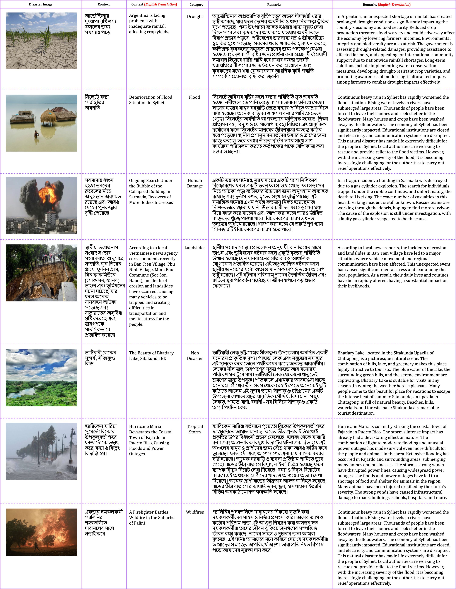
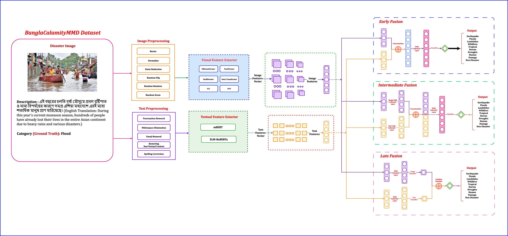

# BanglaCalamityMMD-A-Comprehensive-Benchmark-Dataset-for-Multimodal-Disaster-Identification


## Abstract
The abundance of social media datasets with crisis messages has greatly impacted disaster response and assessment. Extracting vital information from this data is crucial for enhancing situational awareness and enabling rapid decision-making, necessitating robust techniques to filter out misleading and irrelevant content. This study introduces a hybrid multimodal fusion technique that integrates text and image data to identify relevant disaster-related images from social media. It represents a pioneering effort in multimodal disaster identification for the Bangla language, addressing a significant gap where previous research has focused exclusively on English text. To facilitate this leap, We curated the “BanglaCalamityMMD” dataset, which includes 7,903 data points distributed across seven disaster categories such as Earthquake, Flood, Landslides, Wildfires, Tropical Storms, Droughts, and Human Damage, along with a non-disaster category. Our technique employs advanced deep learning methodologies: DisasterTextNet for text-based disaster detection, DisasterImageNet for image-based disaster categorization, and DisasterMultiFusionNet, which combines text and image modalities using fusion techniques like Early Fusion, Late Fusion, and Intermediate Fusion. The system uses Vision Transformer variations to extract visual data and pre-trained BERT models for textual insights. Our multimodal architecture (DisasterMultiFusionNet) significantly outperforms unimodal approaches. The unimodal text-based approach achieves 79.90% accuracy with mBERT, also the image-based approach reaches 78.65% accuracy using Swin Transformer. In comparison, our multimodal technique achieves 85.25% accuracy with Swin Transformer and mBERT (DisasterMultiFusionNet), showing a 5.35% improvement over the best unimodal approach. This highlights the effectiveness of our fusion technique and the reliability of our multimodal framework in enhancing disaster identification accuracy. To our knowledge, this is the first research on multimodal disaster identification in the low-resource Bangla language context.

**Paper Link:** [BanglaCalamityMMD: A comprehensive benchmark dataset for multimodal disaster identification in the low-resource Bangla language](https://www.sciencedirect.com/science/article/pii/S2212420925006247)  
---

## Dataset

| Class            | Train | Validation | Test | Total |
|------------------|:-----:|:----------:|:----:|:-----:|
| Earthquake       | 800   | 100        | 100  | 1,000 |
| Flood            | 800   | 100        | 100  | 1,000 |
| Landslides       | 803   | 100        | 100  | 1,003 |
| Wildfire         | 720   | 90         | 90   | 900   |
| Tropical Storm   | 800   | 100        | 100  | 1,000 |
| Drought          | 800   | 100        | 100  | 1,000 |
| Human Damage     | 800   | 100        | 100  | 1,000 |
| Non-Disaster     | 800   | 100        | 100  | 1,000 |
| **Total**        | 6,323 | 790        | 790  | 7,903 |

- **Total instances:** 7,903  
- **Categories (8 classes):**  
  - Earthquake  
  - Flood  
  - Landslides  
  - Wildfire  
  - Tropical Storm  
  - Drought  
  - Human Damage  
  - Non-Disaster  

- **Split:**  
  - Training: 6,323  
  - Validation: 790  
  - Testing: 790  

- **Dataset Link:** [BanglaCalamityMMD on Mendeley](https://data.mendeley.com/datasets/7dggbjn5sd/1)  
- **Example:**  
  

---

## Methodology
- **DisasterTextNet:** A text-based framework built on mBERT and fine-tuned on our custom-curated dataset, designed to reliably identify disaster-related information across multiple disaster categories (Accuracy: 0.7990).
- **DisasterImageNet:** An image-based method implemented with the Swin Transformer, which captures both local and global image features, and fine-tuned on our dataset to reliably detect disaster images across multiple categories (Accuracy: 0.7865).
- **DisasterMultiFusionNet:** A multimodal framework where features from the Swin Transformer (images) and mBERT (text) are extracted independently, concatenated at an early stage, and passed through fully connected layers. This allows the model to learn joint representations that capture complementary semantic and visual cues from both modalities (Accuracy: 0.8525).
  
  

---

## Results

## Text-Based Models

| Approach   | Model       | Accuracy | Specificity | Sensitivity | F1-Score |
| ---------- | ----------- | :------: | :---------: | :---------: | :------: |
| Text-Based | **mBERT**   |  0.7990  |    0.8806   |    0.7987   |  0.7994  |
|            | XLM-RoBERTa |  0.7745  |    0.7875   |    0.7683   |  0.7778  |

---

## Image-Based Models

| Approach    | Model                | Accuracy | Specificity | Sensitivity | F1-Score |
| ----------- | -------------------- | :------: | :---------: | :---------: | :------: |
| Image-Based | EfficientFormer      |  0.7766  |    0.7917   |    0.7692   |  0.7803  |
|             | PoolFormer           |  0.7563  |    0.7667   |    0.7510   |  0.7588  |
|             | PVT                  |  0.7448  |    0.7604   |    0.7374   |  0.7487  |
|             | SwiftFormer          |  0.7594  |    0.7688   |    0.7546   |  0.7616  |
|             | **Swin Transformer** |  0.7865  |    0.8229   |    0.7670   |  0.7940  |
|             | ViT                  |  0.7854  |    0.8146   |    0.7697   |  0.7915  |

---

## Multimodal Models with Early Fusion

| Approach     | Model                                                 | Accuracy | Specificity | Sensitivity | F1-Score |
| ------------ | ----------------------------------------------------- | :------: | :---------: | :---------: | :------: |
|              | EfficientFormer + mBERT                               |  0.7812  |    0.7913   |    0.7785   |  0.7847  |
|              | PoolFormer + mBERT                                    |  0.7639  |    0.8067   |    0.8110   |  0.8080  |
|              | PVT + mBERT                                           |  0.7963  |    0.7913   |    0.8005   |  0.7977  |
|              | SwiftFormer + mBERT                                   |  0.8125  |    0.8215   |    0.8177   |  0.8135  |
|              | **Swin Transformer + mBERT (DisasterMultiFusionNet)** |  0.8525  |    0.8537   |    0.8581   |  0.8532  |
| Early Fusion | ViT + mBERT                                           |  0.7800  |    0.7829   |    0.7857   |  0.7814  |
|              | EfficientFormer + XLM-RoBERTa                         |  0.7588  |    0.7721   |    0.7651   |  0.7605  |
|              | PoolFormer + XLM-RoBERTa                              |  0.7638  |    0.7653   |    0.7710   |  0.7657  |
|              | PVT + XLM-RoBERTa                                     |  0.8375  |    0.8537   |    0.8438   |  0.8384  |
|              | SwiftFormer + XLM-RoBERTa                             |  0.8425  |    0.8470   |    0.8484   |  0.8435  |
|              | Swin Transformer + XLM-RoBERTa                        |  0.8213  |    0.8251   |    0.8259   |  0.8224  |
|              | ViT + XLM-RoBERTa                                     |  0.8462  |    0.8456   |    0.8506   |  0.8466  |

---

## Multimodal Models with Late Fusion

| Approach    | Model                          | Accuracy | Specificity | Sensitivity | F1-Score |
| ----------- | ------------------------------ | :------: | :---------: | :---------: | :------: |
|             | EfficientFormer + mBERT        |  0.7675  |    0.7756   |    0.7743   |  0.7696  |
|             | PoolFormer + mBERT             |  0.8287  |    0.8257   |    0.8370   |  0.8304  |
|             | PVT + mBERT                    |  0.7925  |    0.7961   |    0.7979   |  0.7979  |
|             | SwiftFormer + mBERT            |  0.7600  |    0.7598   |    0.7682   |  0.7622  |
|             | Swin Transformer + mBERT       |  0.7575  |    0.7595   |    0.7610   |  0.7599  |
| Late Fusion | ViT + mBERT                    |  0.8150  |    0.8250   |    0.8240   |  0.8160  |
|             | EfficientFormer + XLM-RoBERTa  |  0.8263  |    0.8245   |    0.8340   |  0.8276  |
|             | PoolFormer + XLM-RoBERTa       |  0.7712  |    0.7721   |    0.7770   |  0.7730  |
|             | PVT + XLM-RoBERTa              |  0.8107  |    0.8113   |    0.8172   |  0.8121  |
|             | SwiftFormer + XLM-RoBERTa      |  0.8141  |    0.8156   |    0.8195   |  0.8152  |
|             | Swin Transformer + XLM-RoBERTa |  0.8185  |    0.8118   |    0.8241   |  0.8197  |
|             | ViT + XLM-RoBERTa              |  0.8163  |    0.8261   |    0.8218   |  0.8174  |

---

## Multimodal Models with Intermediate Fusion

| Approach            | Model                          | Accuracy | Specificity | Sensitivity | F1-Score |
| ------------------- | ------------------------------ | :------: | :---------: | :---------: | :------: |
|                     | EfficientFormer + mBERT        |  0.7812  |    0.7913   |    0.7785   |  0.7847  |
|                     | PoolFormer + mBERT             |  0.7639  |    0.7642   |    0.7701   |  0.7664  |
|                     | PVT + mBERT                    |  0.8057  |    0.8119   |    0.8132   |  0.8078  |
|                     | SwiftFormer + mBERT            |  0.8502  |    0.8485   |    0.8546   |  0.8519  |
|                     | Swin Transformer + mBERT       |  0.7683  |    0.7694   |    0.7725   |  0.7705  |
| Intermediate Fusion | ViT + mBERT                    |  0.8301  |    0.8357   |    0.8322   |  0.8314  |
|                     | EfficientFormer + XLM-RoBERTa  |  0.8405  |    0.8373   |    0.8462   |  0.8421  |
|                     | PoolFormer + XLM-RoBERTa       |  0.7526  |    0.7498   |    0.7603   |  0.7552  |
|                     | PVT + XLM-RoBERTa              |  0.8208  |    0.8231   |    0.8267   |  0.8225  |
|                     | SwiftFormer + XLM-RoBERTa      |  0.8267  |    0.8294   |    0.8313   |  0.8276  |
|                     | Swin Transformer + XLM-RoBERTa |  0.8359  |    0.8306   |    0.8392   |  0.8374  |
|                     | ViT + XLM-RoBERTa              |  0.8384  |    0.8432   |    0.8401   |  0.8395  |

---


## Future Work
- **Expanded Dataset:** Include more disaster types, severity levels, and stages.  
- **Linguistic & Cultural Diversity:** Cover Bangla dialects for inclusivity (Chittagonian, Sylheti, Rangpuri).  
- **Explainable AI (XAI):** Use GradCAM, SHAP, LIME, and Vision-Language Models to interpret model decisions.  
- **LLMs for Bangla:** Fine-tune large language models for disaster reporting and communication analysis.  
- **Transfer & Federated Learning:** Improve performance with limited labeled data while preserving privacy.  
- **Robust AI Deployment:** Optimize models for low-resource environments and disaster conditions.  

---

## Authors’ Information

| Fatema Tuj Johora Faria | Mukaffi Bin Moin |
|:-----------------------:|:----------------:|
| fatema.faria142@gmail.com | mukaffi28@gmail.com |
| Department of Computer Science and Engineering, Ahsanullah University of Science and Technology, Dhaka 1208, Bangladesh | Department of Computer Science and Engineering, Ahsanullah University of Science and Technology, Dhaka 1208, Bangladesh |


---

## Citation
If you use this dataset or methodology, please cite:  

```bibtex
@article{BanglaCalamityMMD,
  title = {BanglaCalamityMMD: A comprehensive benchmark dataset for multimodal disaster identification in the low-resource Bangla language},
  journal = {International Journal of Disaster Risk Reduction},
  volume = {130},
  pages = {105800},
  year = {2025},
  issn = {2212-4209},
  doi = {https://doi.org/10.1016/j.ijdrr.2025.105800},
  url = {https://www.sciencedirect.com/science/article/pii/S2212420925006247},
  author = {Fatema Tuj Johora Faria and Mukaffi Bin Moin and Busra Kamal Rafa and Swarnajit Saha and Md. Mahfuzur Rahman and Khan Md Hasib and M.F. Mridha},
  keywords = {Multimodal disaster identification, Bangla language, Low-resource, Social media, Text and image fusion, Deep learning, Disaster analysis}
}

